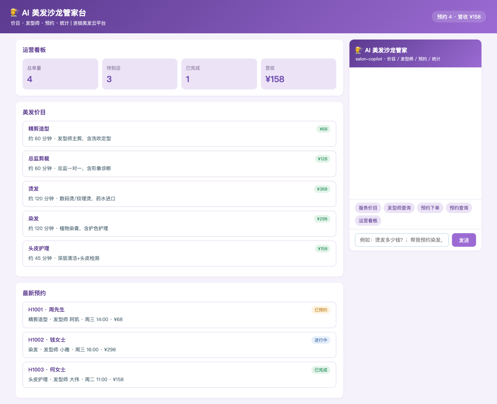
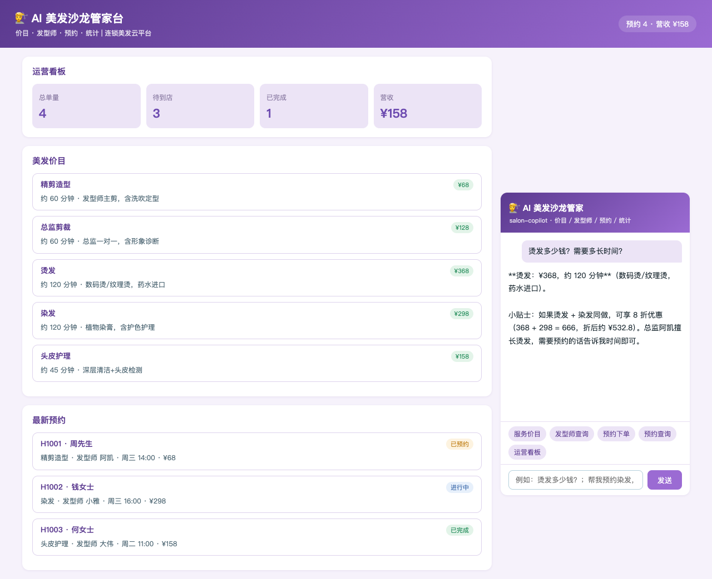
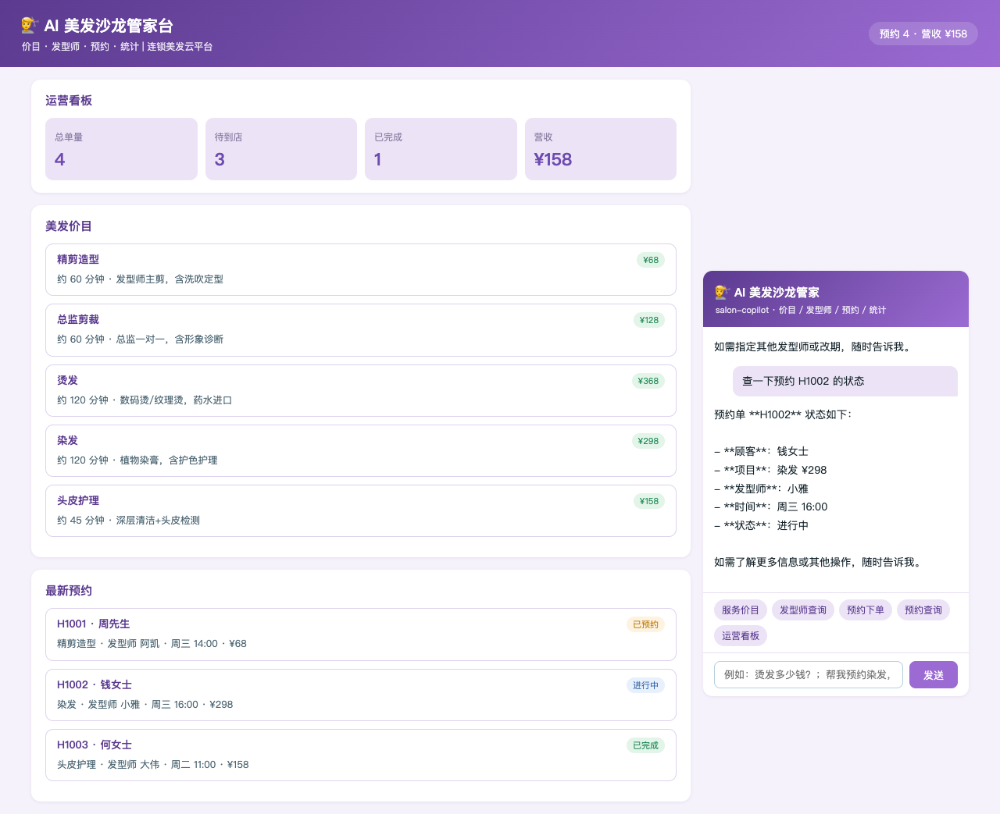
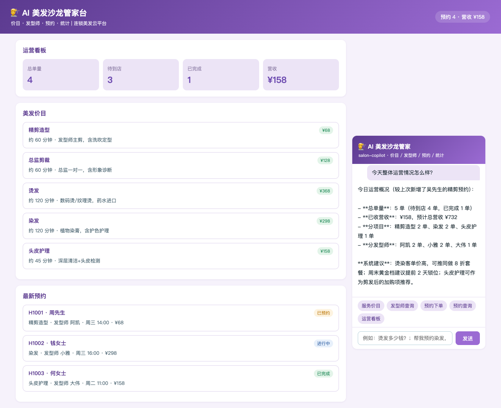

# hair-salon · AI 美发沙龙管家（DSH Java Native Plugin 场景案例 P71）

> 基于 [deepseek-harness-java（DSH）](https://github.com/deepseek-harness-java) Java Native Plugin 机制构建的连锁美发沙龙智能管家：价目查询、发型师查询、预约下单、预约跟踪、运营统计，一个 Agent 全搞定。

  

## ✨ 功能一览

| 能力 | 说明 |
|------|------|
| 💇 价目查询 | 5 个美发项目（精剪造型 68 / 总监剪裁 128 / 烫发 368 / 染发 298 / 头皮护理 158）价格与时长 |
| 👨‍🎨 发型师查询 | 3 位发型师职级与擅长（阿凯 4.9 / 小雅 5.0 / 大伟 4.8）及在约单量 |
| 📝 预约下单 | AI 先复述项目、价格、发型师、时间，经确认后办理，未指定默认总监 |
| 📦 预约查询 | 单号查项目 / 发型师 / 时间 / 金额 / 状态 |
| 📊 运营统计 | 总单量 / 待到店 / 营收与预计营收 / 分项目分发型师分布 / 营销建议 |

## 🖼️ 界面预览

| 截图 | 说明 |
|------|------|
|  | 运营看板首屏：总单量 / 待到店 / 营收 + 美发价目列表 |
|  | AI 价目咨询：烫发 ¥368 / 120 分钟，烫染同做 8 折 |
|  | AI 预约下单：确认后办理（单号 H1005，总监阿凯） |
|  | AI 预约查询：H1002 详情（染发 / 小雅 / 进行中） |
|  | AI 运营统计：订单分布 / 营收 / 营销建议 |

## 🏗️ 项目结构

```
hair-salon/
├── pom.xml                 # Maven 聚合工程（p-app + p-plugin）
├── p-app/                  # Spring Boot 业务应用（端口 18110）
│   └── src/main/java/cn/xiaofuge/l/app/
│       ├── SalonApplication.java    # 启动类
│       ├── LStore.java              # 数据中心（价目/发型师/预约）
│       ├── LController.java         # REST 接口（5 端点）
│       └── AssistantController.java # 页面消息 SSE 代理到 DSH
└── p-plugin/               # DSH Java Native 插件（agentId: salon-copilot）
    └── src/main/java/cn/xiaofuge/l/plugin/
        └── SalonPlugin.java         # 5 个 AI 工具 + 系统提示词 + Hook
```

## 🔧 AI 工具集（5 个）

| 工具名 | 功能 | 关键约束 |
|--------|------|----------|
| `service_list` | 服务价目查询 | 含时长与优惠规则 |
| `stylist_list` | 发型师列表 | 姓名/职级/擅长/评分/在约单量 |
| `book` | 预约下单 | **必须先复述要素经顾客确认后才能调用**；未指定发型师默认总监 S01 |
| `order_info` | 预约查询 | 项目/发型师/时间/金额/状态 |
| `stats` | 运营统计 | 提供营销建议 |

## 🚀 快速开始

```bash
# 1. 构建业务应用
mvn clean package -DskipTests

# 2. 启动应用（端口 18110）
SERVER_PORT=18110 java -jar p-app/target/p-app-1.0.0-SNAPSHOT.jar

# 3. 插件 jar 放入 DSH 插件目录
cp p-plugin/target/p-plugin-1.0.0-SNAPSHOT.jar ~/.dsh/standalone/plugins/salon-copilot.jar

# 4. 注册插件（DSH 运行中）
curl -X POST http://127.0.0.1:8090/api/harness/plugins/install \
  -H 'Content-Type: application/json' \
  -d '{"pluginId":"salon-copilot","displayName":"AI 美发沙龙管家","pluginVersion":"1.0.0","runtimeType":"JAVA_NATIVE","sourcePath":"'$HOME'/.dsh/standalone/plugins/salon-copilot.jar","entrypoint":"cn.xiaofuge.l.plugin.SalonPlugin"}'

# 5. 激活插件
curl -X POST http://127.0.0.1:8090/api/harness/plugins/activate \
  -H 'Content-Type: application/json' -d '{"pluginId":"salon-copilot"}'

# 6. 启动 DSH standalone（如未运行）
cd ~/.dsh/standalone && java -Dspring.profiles.active=standalone -Dserver.port=8090 \
  -jar ~/.dsh/skills/dsh-java-plugin-skills/runtime/deepseek-harness-java-app.jar
```

打开 **http://127.0.0.1:18110** 即可开始对话。

## 🌐 REST 接口

| 方法 | 路径 | 说明 |
|------|------|------|
| GET | `/api/services` | 服务价目列表（含优惠规则） |
| GET | `/api/stylists` | 发型师列表（含在约单量） |
| POST | `/api/book` | 预约下单 `{customer, phone, service, stylistId, time}` |
| GET | `/api/order?orderId=` | 预约查询 |
| GET | `/api/stats` | 运营统计 |
| POST | `/api/assistant/stream` | AI 对话 SSE 代理 |

## ✅ E2E 验证（agent_stream.sh 端到端）

| # | 用户消息 | 调用工具 | 结果 |
|---|----------|----------|------|
| 1 | 有哪些美发项目和价格？ | service_list | ✅ 5 项价格时长 + 优惠 |
| 2 | 有哪些发型师？擅长什么？ | stylist_list | ✅ 3 位发型师职级擅长评分 |
| 3 | 帮吴先生预约染发（含确认语） | book | ✅ 单号 H1004，发型师小雅 |
| 4 | 查预约 H1001 | order_info | ✅ 周先生 / 精剪造型 / 已预约 |
| 5 | 今天运营情况 | stats | ✅ 4 单 / 营收 ¥158 / 建议 |

## 🔑 技术要点

- **DSH Java Native Plugin**：`AbstractHarnessPlugin` + `AbstractTool`，工具以 `plugin__salon-copilot__<name>` 暴露给 LLM
- **系统提示词注入**：`registerSystemPrompt` 固化「预约前必须复述要素确认」「染前过敏测试与染后护色提醒」等业务红线
- **PRE_TOOL_USE Hook**：所有工具调用注入审计上下文
- **SSE 透传**：页面消息经 `AssistantController` 代理到 DSH `/api/agent/stream`（agentId=salon-copilot，超时 180s）
- **环境变量配置**：插件经 `SALON_APP_BASE_URL`（默认 18110）访问业务应用

## 📄 License

MIT
